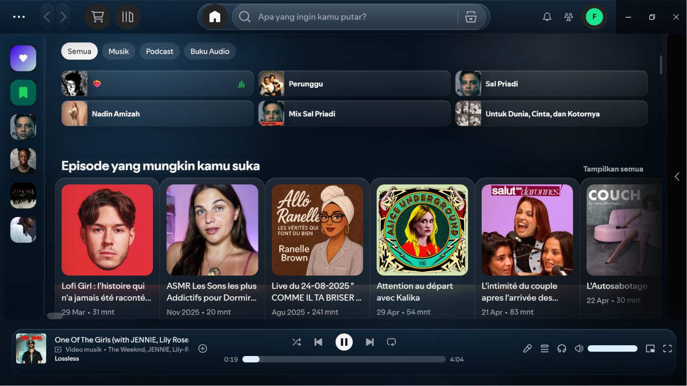

# Apple Spotify Liquid Glass

A dark liquid-glass Spicetify theme inspired by modern Apple/iOS glass surfaces. It keeps Spotify's native layout mostly intact while adding translucent panels, soft blur, rounded controls, subtle highlights, and a floating glass player bar.

## Preview



## Features

- Liquid-glass sidebar, topbar, right panel, cards, menus, and player bar.
- Dark navy/black palette with soft cyan highlights.
- Rounded artwork, cards, controls, and progress bars.
- Modern thin scrollbars.
- Full-width main content spacing.
- Conservative CSS selectors to reduce breakage across Spotify updates.
- Compatible with Spicetify custom apps such as Marketplace and betterLibrary.

## Installation

### Windows

Clone this repository, then run:

```powershell
.\install.ps1
```

Or install manually:

```powershell
$themeDir = "$(spicetify -c | Split-Path)\Themes\AppleSpotifyDark"
New-Item -ItemType Directory -Force -Path $themeDir
Copy-Item ".\color.ini", ".\user.css" -Destination $themeDir -Force
spicetify config current_theme AppleSpotifyDark
spicetify config color_scheme base
spicetify apply
```

Restart Spotify after applying.

### Linux/macOS

```bash
mkdir -p "$(dirname "$(spicetify -c)")/Themes/AppleSpotifyDark"
cp color.ini user.css "$(dirname "$(spicetify -c)")/Themes/AppleSpotifyDark"
spicetify config current_theme AppleSpotifyDark
spicetify config color_scheme base
spicetify apply
```

## Recommended Add-ons

These Marketplace items pair well with the theme:

- Beautiful Lyrics
- betterLibrary
- Dark Lyrics
- Smaller right sidebar cover art

Avoid aggressive layout snippets such as hover panels or dynamic sidebars unless you are ready to tune CSS conflicts.

## Development

Edit `user.css` and run:

```powershell
.\install.ps1
```

The script copies the current files into your Spicetify theme folder and applies the theme.

## Marketplace Manifest

This repo includes `manifest.json` for Spicetify Marketplace compatibility. Before publishing to Marketplace, add the GitHub topic `spicetify-themes` to the repository.

## License

MIT
